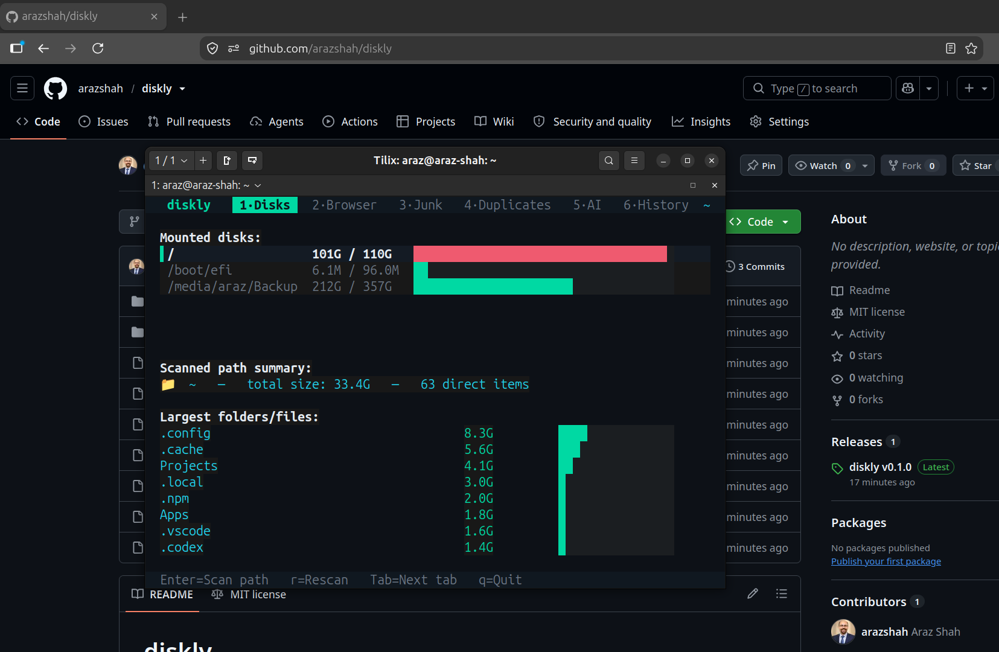

# diskly

> Terminal-first disk space analyzer, junk finder, duplicate remover, and
> optional LLM-powered cleanup advisor — built with [Bun] and a custom TUI.

diskly helps you understand where your disk space is going, safely free
what you don't need, and ask an AI assistant (via [AvalAI]) for a cleanup
plan — all from your terminal.

[Bun]: https://bun.sh
[AvalAI]: https://avalai.ir

---
<p align="center">
  
  <br />
  <em>diskly — terminal disk space analyzer</em>
</p>

## ✨ Features

- **📊 Disks overview** — see every mounted filesystem, its used/total
  size, and a live usage bar.
- **🌳 File-tree browser** — navigate your disk by size, jump into the
  largest folders, and quarantine anything you don't need.
- **🧹 Junk finder** — caches, build artefacts, old logs, package-manager
  leftovers, and more, classified by risk level.
- **🗂 Duplicate detector** — content-hash-based duplicate scanner that
  shows you exactly how much space you can reclaim.
- **🤖 AI advisor (AvalAI)** — ask the model to analyse your disk and
  suggest the safest next steps. No telemetry; the API key stays in your
  shell environment.
- **↩️ Undo / journal** — every destructive action is recorded so you can
  revert it from the **History** tab.
- **🎨 Pure-ANSI TUI** — zero external terminal libraries; double-buffered
  diff rendering keeps it flicker-free.

---

## 📦 Installation

diskly targets **[Bun] ≥ 1.1** (it uses `bun build --compile` to produce a
single self-contained binary, and `Bun.file`, `Bun.write`, etc. internally).

### Option 1 — Install from a local clone (recommended for now)

```bash
git clone https://github.com/arazshah/diskly.git
cd diskly
bun install                  # optional, only needed for type-checking
bun run build                # → dist/diskly  (single binary)
sudo install -m 0755 dist/diskly /usr/local/bin/diskly
diskly
```

### Option 2 — Run from source (no install step)

```bash
git clone https://github.com/arazshah/diskly.git
cd diskly
bun run dev
```

### Option 3 — `bun add -g` (once published)

```bash
bun add -g diskly
diskly
```

### Option 4 — One-liner installer (after first release)

```bash
curl -fsSL https://raw.githubusercontent.com/arazshah/diskly/main/install.sh | bash
```

> The `install.sh` script downloads the latest `bun build --compile`
> binary for your platform into `~/.local/bin/diskly`.

---

## 🚀 Usage

```text
diskly [options]

Options:
  -v, --version   print the version and exit
  -h, --help      print this help message and exit
```

Run with no arguments to launch the interactive TUI. Inside the TUI:

| Key                     | Action                                    |
| ----------------------- | ----------------------------------------- |
| `←` / `→`               | Switch tabs                               |
| `Tab`                   | Next tab                                  |
| `↑` / `↓` / `Enter`     | Navigate / open                           |
| `Space`                 | Toggle selection                          |
| `a`                     | Select / deselect all                     |
| `d`                     | Delete (or quarantine) the selection      |
| `r`                     | Re-run the current scan                   |
| `i`                     | Focus the AI input box                    |
| `u`                     | Undo the last destructive operation       |
| `q` / `Ctrl+C`          | Quit                                      |

---

## ⚙️ Configuration

diskly reads its configuration from environment variables and
`~/.config/diskly/config.json` (created on first run).

| Variable          | Required | Description                                            |
| ----------------- | -------- | ------------------------------------------------------ |
| `AVALAI_API_KEY`  | for AI   | Your AvalAI API key. Without it the AI tab is disabled. |
| `DISKLY_HOME`     | no       | Override the scanned root path.                        |
| `NO_COLOR`        | no       | Disable colour output (ANSI).                          |

Example:

```bash
export AVALAI_API_KEY="sk-…"
diskly
```

---

## 🛠 Development

```bash
# Run from source, with hot reload of the CLI entry:
bun run dev

# Type-check the whole project (no emit):
bunx tsc --noEmit

# Produce a standalone binary into dist/:
bun run build

# Cross-compile for Linux x64 (override with --target=bun-darwin-arm64, etc.):
bun run build:target
```

The project has no runtime dependencies — only dev tooling (`@types/bun`,
`typescript`). The TUI engine in `src/tui/screen.ts` is ~800 lines of raw
ANSI + a double-buffered diff renderer, no third-party terminal libraries.

```
src/
├── cli.ts          # CLI entry (handles --version / --help, then boots TUI)
├── index.ts        # Legacy entry kept for `bun run src/index.ts`
├── core/           # Filesystem scanning, rules, duplicates, actions
├── llm/            # AvalAI client + digest/advisor logic
└── tui/            # Pure-ANSI TUI engine, widgets, and the main app loop
```

---

## 🤝 Contributing

1. Fork the repository.
2. Create a feature branch: `git checkout -b feat/my-thing`.
3. Commit your change with a clear message.
4. Open a pull request.

Please keep PRs focused and run `bunx tsc --noEmit` before pushing.

---

## 📝 License

[MIT](LICENSE)
